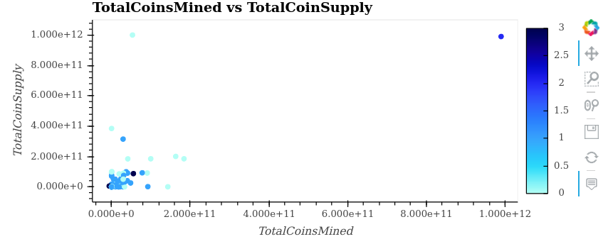
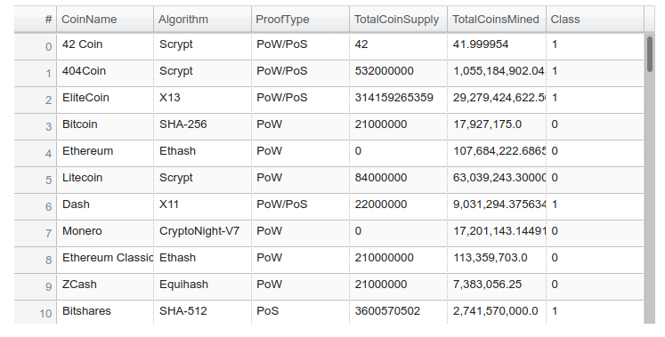

# Cryptocurrencies
Using unsupervised learning to determine which cryptocurrencies are good investments

## Aim

THe aim of this project is to group the cryptocurrencies in order to determine the products in which to invest using data tables and data visualizations

## Input

The input to this analysis is the crypto_data.csv file which contains the following columns:

|Column          |  Type    |
|----------------|----------|
|Unnamed: 0      |  object  |
|CoinName        |  object  |
|Algorithm       |  object  |
|IsTrading       |  bool    |
|ProofType       |  object  |
|TotalCoinsMined |  float64 |
|TotalCoinSupply |  object  |

## Processing

**Please refer to the [notebook](./Crypto-currencies.ipynb) for a detailed explanation of the processing.**

## Graphs

### Elbow Curve

In order to determine how many clusters to use, the following elbow curve was created.

Based on this curve, it was decided that the appropriate number of clusters is 4.

### 3-D Scatter Plot

After the determination to use 4 clusters was made, the following 3-D scatter plot was created to provide a visual of the clustering:

### 2-D Scatter Plot

Another visual to display the clustering was the following 2-D scatter plot:

## Tables

### Data Table

Yet another method to display the clustering of stocks was the data table which comprised the following columns: 

* CoinName
* Algorithm
* ProofType
* TotalCoinSupply
* TotalCoinsMined
* Class

The Class column identifies the cluster to which the coin belongs.

## Conclusion

It would appear that splitting up the coins into four clusters was quite appropriate. The clusters fall into the following categories:

* High supply, low demand
* Medium supply, low demand
* Low supply, low demand
* High supply, high demand

Beyond these statistics, information about the companies issuing those currencies and a price history of those currencies would be very instructive in determining the cluster of currencies into which it would be most prudent to invest.